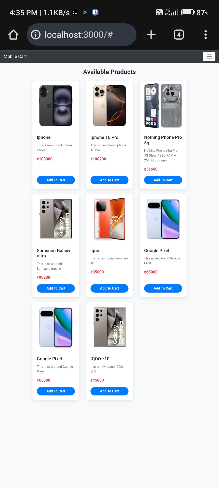
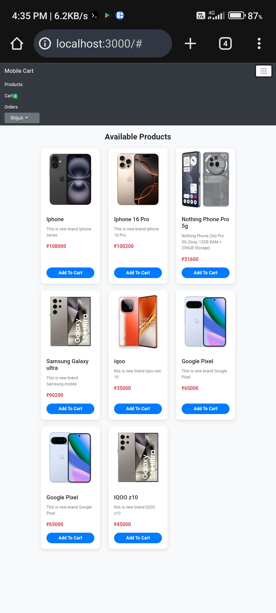

# MOBILE CART WEB APP
**Mobile Cart is a full-stack e-commerce platform where users can browse products, add items to their cart, place orders, and complete payments using Razorpay. The application includes a robust user authentication system, secure session management, and order history tracking.**

**Admins can manage the entire store through an Admin Dashboard—including adding products, editing details, uploading images, managing users, and viewing orders. The backend is built with Node.js and Express, data is stored in MongoDB, and the frontend uses Handlebars for dynamic content rendering.**

## Features
**👤 User Side :**

1.User signup and login (session-based authentication)

2.Browse all mobile products with images, prices, and descriptions

3.Add to cart, update quantities, remove items

4.View cart summary with total calculation

5.Place orders with address and payment options

6.Razorpay payment gateway integration for secure online payments

7.View order history and order details

8.Fully responsive UI for mobile devices

**🛠️ Admin Side:**

1.Admin login system

2.Add, edit, and delete products

3.Upload product images to server storage

4.View all users and their user IDs

5.Access all orders placed by all users

6.View order details, product details, and order status

7.Manage inventory and pricing


## Technical Stack

**Frontend:** HTML, CSS, Bootstrap, Handlebars (HBS)

**Backend:** Node.js, Express.js

**Database:** MongoDB

**Templating:** Handlebars

**Authentication:** Express-session

**Payment Integration:** Razorpay API

**Cloud/Image Handling:** Local server storage (public/product-images)

**Architecture:** MVC pattern with helper modules


## Screenshot
 

 

## ⚙️ Installation and Setup
### 🔧 Prerequisites
- Node.js & npm installed
- MongoDB running locally or using cloud (MongoDB Atlas)
### 🏁 Set Up Project

```bash
git clone <repo-url>
cd Mobile-Cart
npm install
```


### Add .env file:
```bash
RAZORPAY_KEY_ID=your_key
RAZORPAY_KEY_SECRET=your_secret
MONGO_URL=mongodb://localhost:27017/mobile-cart
```

### ▶️ Run Server
```bash  
npm start
```
### Open in browser:
👉 http://localhost:3000

## 👨‍💻 Developer

**Shiju A**
 📌 Full Stack Developer — MERN & Python

